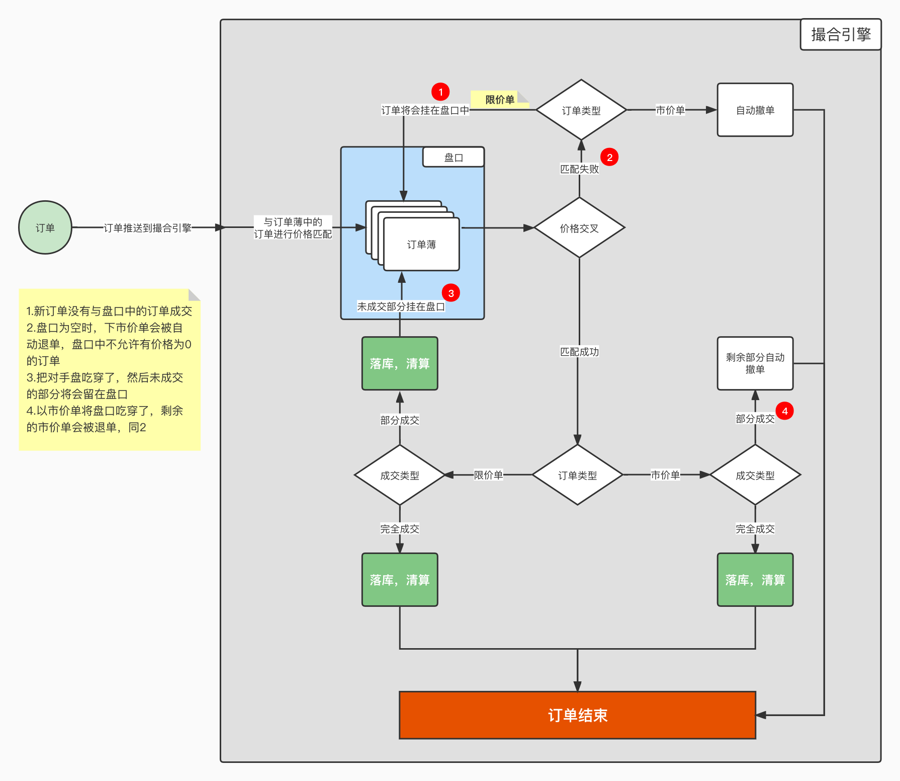

# open-matching

## 内存撮合引擎业务讲解

开源的数字货币/股票证券撮合引擎不少，大多也做到了开箱即用，但是这么多的开源项目中从没见过到讲产品逻辑的，本项目聚焦在撮合业务逻辑，以最小化代码实现撮合功能，订单读取，资金流转，订单落库等不做重点说明。

## 术语

> order/订单/挂单：挂单行为/挂单/下单

> trade/成交：订单成交后转化为成交记录，一笔order可能会对应多笔trade

> taker：主动方/吃单一方

> maker：被动方/被吃单的一方/挂单且未立即成交的一方

> 盘口/订单薄：[买盘卖盘的订单集](./images/盘口模型.jpg)

> 清算：订单成交后进行资金的结算，例如A用户使用USDT购买BTC，B用户出售BTC的到USDT，清算过程就是AB双方（一般还有平台收取手续费）交换币的过程

> 限价单：以指定价格成交，如过未达到成交价格订单则会以价格优先，时间有限挂在盘口上

> 市价单：以市场（盘口）上对手的报价为成交价，本质上是价格为0的限价单

> 退残渣：举例：ABC/USDT最小成交数量为0.1，以市价单吃单，实际成交数量为0.1，剩余资金仅能购买0.02，此时剩余资金会进行退还

> 持久化：订单，成交，资金等落库

> 价格交叉：买卖双方的报价有交集时订单才能成交

> 事件驱动模型：在没有新事件发生时，整个系统不会进行运作，套用在撮合引擎上就是在没有新订单进来时，已经存在的订单不会进行任状态和资金上的变化

## 撮合流程讲解

1. ### 撮合总体流程

   

2. ### 

​	
